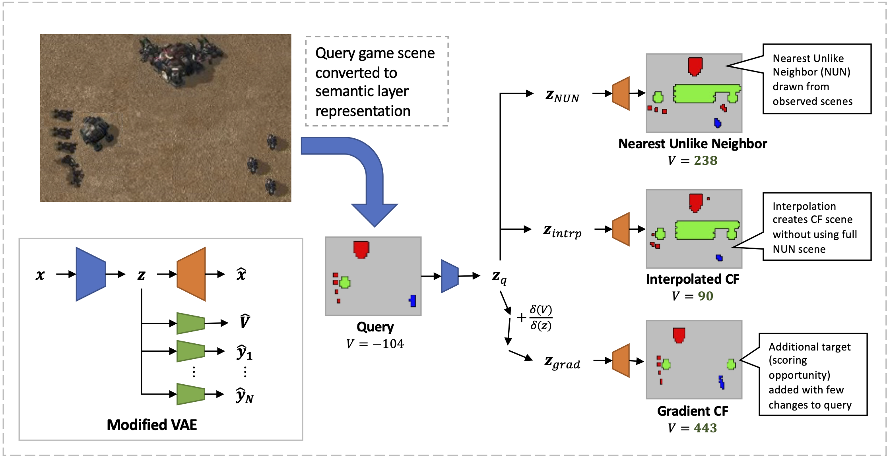

# Imago


Imago is a Python 3 library for developing counterfactuals from a jointly trained generative model.  

This contains the library and IPython notebook examples for the CARLI Imagination component under DARPA CAML.  This uses a variational autoencoder to convert a PySC2 observation, perturb it, and generate the resulting interpolation or extrapolation.  

## Installation

To install the imago package, run ``setup.py`` to install locally.

```
pip install -e . setup.py
```

Download and install the archived trajectories and model files.

TODO: Identify relevant hosting options.

### System Requirements

This requires a modern Intel 64 bit CPU with at least 16GB RAM running Ubuntu Linux, at least version 16.04 and above.  The demonstration is set to use CPU computations, so a discrete GPU is not necessary.

However, for further development or experimentation from this codebase, we recommend having a discrete Nvidia GPU with at least 6GB of VRAM available.

## Experiments

### XAI World
To replicate the XAIWorld counterfactual quality metrics experiments against each of the domains:

- **Canniballs**: ``python -m imago.experiments.xaiworld_canniballs``
- **Cartpole**: ``python -m imago.experiments.xaiworld_cartpole``
- **Reaver Assault**: ``python -m imago.experiments.xaiworld_ray2``
- **Reaver Assault, Recon Only**: ``python -m imago.experiments.xaiworld_ray2_recononly``

### Notebook Experiments
Experiments are categorized by major theme and time started, and are listed under the notebooks directory.  Each of the IPython notebook files contains a brief description, relevant findings, and setup.  Notebooks are organized by date, using a YYMMDD format where YY corresponds to the two digit year, MM the two digit month, and DD the two digit day indicator.  

The most current results illustrating the use of the affine remapping layer in the VAE is given under /notebooks/200713_semframe.  The README.md there lists the invocations needed to featurize replays using sc2recorder.

Existing results for visualizing interpolations are viewable under /notebooks/200713_semframe/200824_results_viz.ipynb.  Please see previous notebooks in August (2008*) for finer grained analyses of interpolation trajectory behavior for the explroed methods.

Previous dated analyses under notebooks represent different lines of investigation, 

  200312_Z_Analysis: Direct perturbation of latent encodings in a standard VAE
  200417_supervised: Using supervised perturbations in a conditional VAE
  200618_fwd_project: Experiments using sequential rollout models 

## Counterfactual Generation
The counterfactual generation experiments can be accessed via a single wrapper class, imago/perturb/cfs/run_experiments.py:CFExps.  The class accepts a domain, variable to perturb to obtain a counterfactual for, and a dataset of instances to work with.  

An example that loads the Cartpole domain and data over the targeted variable follows:
```
        from imago.domains.cartpole.cartpole_setup import load_domain, load_data
        from imago.perturb import Perturb
        from imag.perturb.cfs.run_experiments import CFExps
        
        train_ds, test_ds = load_data()
        cp_domain = load_domain(device="cuda:0")
        varname = VALUE_FUNCTION
        tgt_mag = 2 * value_std
        direction = +1
        perturb = Perturb(varname, direction, tgt_mag=tgt_mag)
        cf_exp = CFExps(cp_domain, perturb, train_ds)
        cf_exp.auto_experiment()  # Runs the experiment using 100 good starting points
```

### Generating Instance-based (CBR) Counterfactual Trajectories

To generate counterfactual trajectories for the Reaver Assault domain, invoke the inst_cf_analysis 
module in the imago repository directory,

  ```
  cd $IMAGO_ROOT
  python -m imago.domains.reaverassaulty2.cf.inst_cf_analysis $CONFIG_FILE
  ```
  
where $CONFIG_FILE is the filepath to the configuration file to use. An example YAML 
configuration is given under imago/imago/domains/reaverassaulty2/configs/conf_scenes_debug.yaml.

$IMAGO_ROOT is the local directory the imago project was checked out into.

To specify the SC2 query points, add the episode and frame number as key/value entries
under the `scenes` key.  For example,

```
scenes:
        ep1007: 163
        ep1014: 169
        ep100: 232
```

This will query episodes ep1007 at frame 163, ep1014 at frame 169, ep100 at frame 232.

The next set of keys configures the interestingness variable to generate a counterfactual for.

```
varname: Confidence
direction: -1
tgt_mag: 0.5 
```

`varname` indicates the variable to use.  Current valid variable values are,

- "Confidence"
- "Goal Conduciveness"
- "Riskiness"
- "Incongruity"

The desired counterfactual is selected by the `direction` and `tgt_mag` keys.  
`direction` indicates the polarity of the desired change, and `tgt_mag` indicates the
minimum magnitude of difference between the query and counterfactual.  Direction values
indicate,
- +1 = Counterfactual should have variable `varname` greater than at the query point
- -1 = Counterfactual should have variable `varname` less than at the query point

Following the above example, counterfactuals should have a Confidence lower than at the
query point, with an absolute difference of at least 0.5.

This collects HTML summaries of the counterfactual trajectories from
five points in the list of valid counterfactuals from data.  These are sampled
uniformly in the inclusive range of the closest counterfactual to the query to the furthest.

The results are placed into the directory given under the `results_dir` key.

## Generating Main Counterfactual Paper Results

See imago.perturb.cfs.run_experiments, which contains the CFExps (Counterfactual Experiments) class that runs the experiments against the gradient, instance based, and other configurations.  This is currently referenced by:

  imago/notebooks/220502_highlights/220601_ray2_split_model_cfs.py
  imago/notebooks/220502_highlights/220508_canniballs_cfs.py

Note that this does not render trajectories, but see imago.analysis.walk::ZTrajectory, which contains routines for rendering out videos of the interpolation for study.


### Experimentation Domains
Each of the experimental domains (Cartpole, Canniballs, PySC2 Assault) are specified using the ImagoDomain class.  This contains pointers to the model used, the observation difference computation model, and a rendering function.

### Formatting Data 
The Datasets for each domain use the DictTensorDataset class.  Because domains can contain multiple targets, each instance is represented by a dictionary, with observations accessed via the special OBS key and the other values containing the targets.  Please see the load_data() routines for each of the domains for examples of how to muster the data.


# License Notice
The code is provided under the GPLv3 license (see [full license file](LICENSE.md)). To use the code under a different set of licensing terms, please contact [SRI International](https://www.sri.com/)'s licensing department at [licensee-ops@sri.com](mailto:licensee-ops@sri.com).

# Support

If you have questions about using this package or find errors in the code you can post an issue or contact [Eric Yeh](mailto:eric.yeh@sri.com)  or [Melinda Gervasio](mailto:melinda.gervasio@sri.com).

# Acknowledgements

This material is based upon work supported by the Defense Advanced Research Projects Agency (DARPA) under Contract No. HR001119C0112.